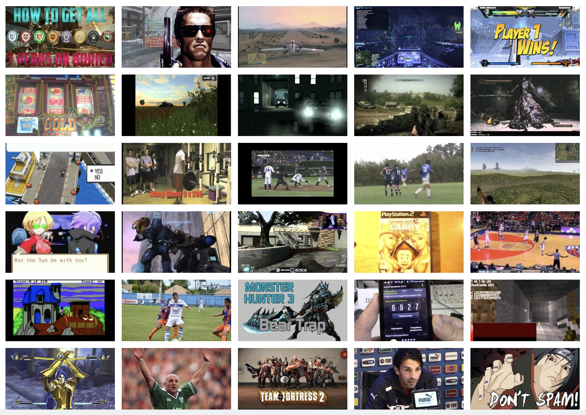
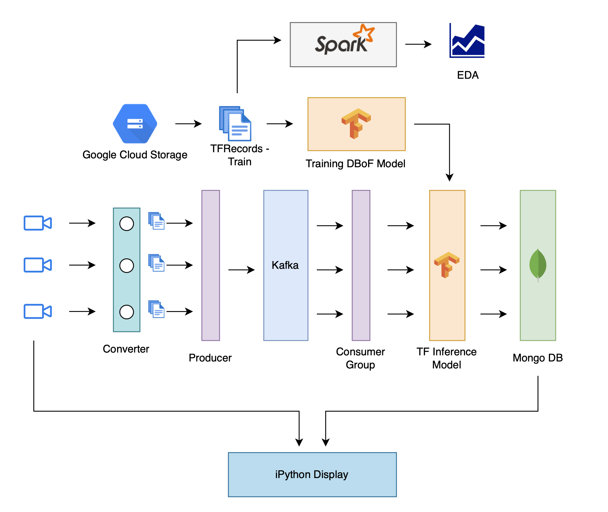
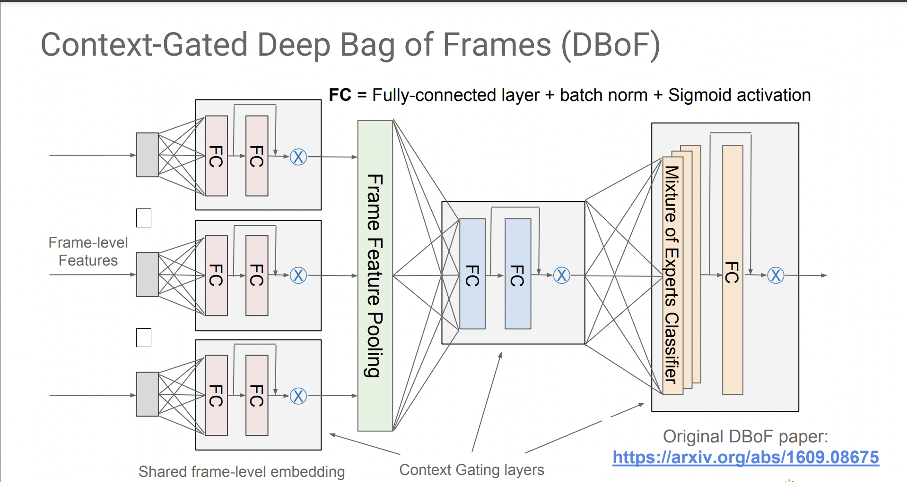

# Scene Understanding with YouTube 8M Dataset 

## Overview

The YouTube 8M dataset, released in June 2019, provides segment-level annotations with human-verified labels on approximately 237,000 segments across 1,000 classes. This dataset was derived from the validation set of the YouTube-8M dataset.

### Dataset Statistics

- **Frame Level Data Size:** 1.71 TB
- **Number of Shards:** 3,844

### Data Schema

The data is organized with the following schema:

- **"video-id":** Unique identifier for each video.
- **"labels":** A list of labels associated with that video.

Each frame in the dataset includes the following features:

- **"rgb":** Float array of length 1,024.
- **"audio":** Float array of length 128.

## Implementation Details

We have provided images to illustrate the architecture and visual aspects of our implementation.

### Architecture Overview

The diagram illustrates the architecture of our implementation, showcasing the flow and components used to process and analyze the YouTube 8M dataset.

## Context-Gated DBoF Model

## Visualising the results

We use ipywidgets to have real-time playback of our predictions

### References

1. **Dataset:** [YouTube 8M Dataset](https://research.google.com/youtube8m/)
2. **YouTube-8M: A Large-Scale Video Classification Benchmark:** [Paper](https://arxiv.org/abs/1609.08675)
3. **Learnable pooling with Context Gating for video classification:** Antoine Miech, Ivan Laptev, and Josef Sivic. [Paper](https://arxiv.org/abs/1706.06905)
4. **Context-gated dbof models for YouTube-8M:** Paul Natsev. 2018. [PDF](https://static.googleusercontent.com/media/research.google.com/en//youtube8m/workshop2018/natsev.pdf)
5. **LinkedIn spark-tfrecord:** [GitHub Repository](https://github.com/linkedin/spark-tfrecord)
6. **Kafka in Action: Building a Distributed Multi-Video Processing Pipeline with Python and Confluent:** [Article](https://towardsdatascience.com/kafka-in-action-building-a-distributed-multi-video-processing-pipeline-with-python-and-confluent-9f133858f5a0)
